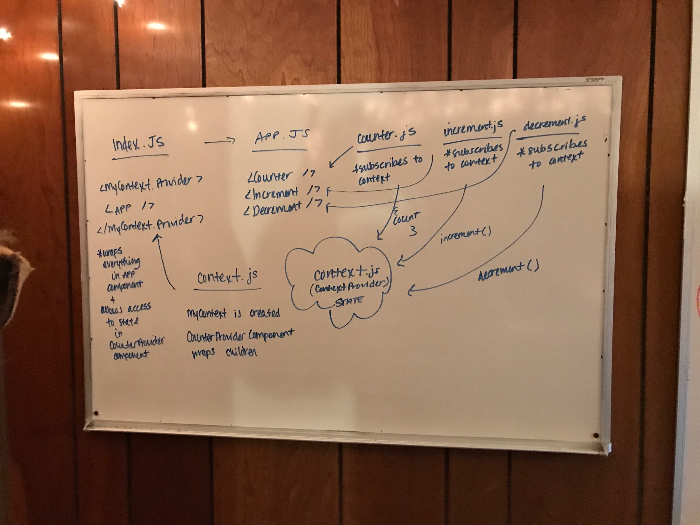

 LAB
=================================================

## Context & Hooks L36

### Author: Heather Cherewaty

### Links and Resources

* [repo](https://github.com/hcherewaty/36-context-and-hooks)
* [travis](https://www.travis-ci.com/hcherewaty/36-context-and-hooks/builds/100550294)

### Modules
#### `modulename.js`
##### Exported Values and Methods
#### `index.js`
Renders the `App` component, wraps `App` component and all preceeding components in `MyContext.Provider` component to allow state access. `index.js` App component rendered via `root` on `index.html`.

#### `app.js`
Renders the `Counter`, `Incrementer`, and `Decrementer` components.

#### `counter.js`
Subscribes to `MyContext` as a consumer to access state.  Renders the current state of count.

#### `incrementer.js`
Subscribes to `MyContext` as a consumer to access state.  Renders button that changes state of count +1 `onClick`. 

#### `decrementer.js`
Subscribes to `MyContext` as a consumer to access state.  Renders button that changes state of count -1 `onClick`. 

### Setup
#### `.env` requirements
* None.

#### Running the app
* `npm start`
  
#### Tests
* To run tests use the command `npm test` or `npm test component.test.js`.
* Assertions made: 
    * `componenets.test.js`: Do the components exist, do they render what is expected?
    * Does state change on `increment.js` and `decrement.js` components when button is clicked?

#### UML

